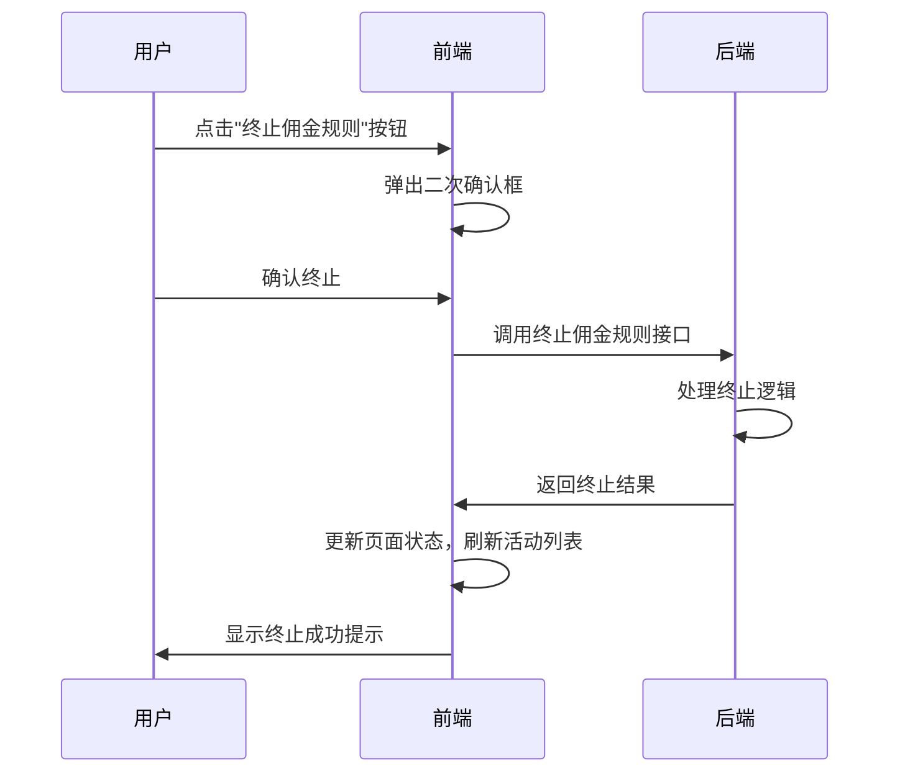
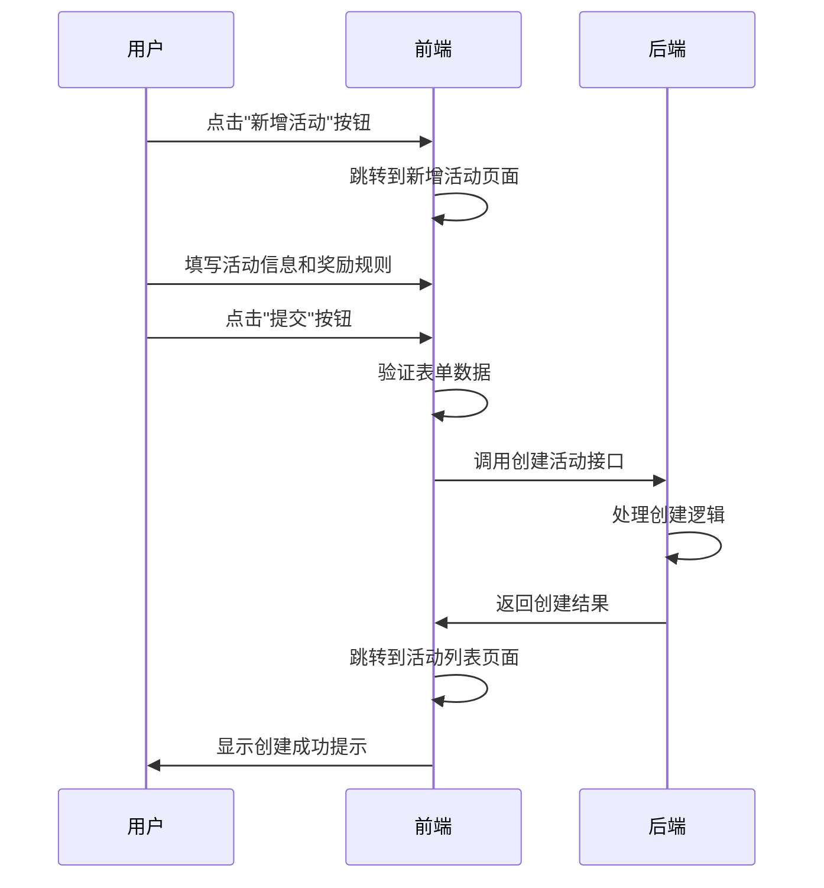

# PRD: 首单活动管理系统

---

## 元数据
| 字段 | 值 |
|------|-----|
| 作者 | 系统生成 |
| 创建时间 | 2026-03-31 |
| 需求来源 | 华润万家全员带货管理后台 |
| 状态 | Draft |

---

## 1. 需求概述
### 问题/背景
> 为什么要做这个功能？解决什么业务问题？

为了激励促销员引导新用户下单，华润万家需要一个首单活动管理系统，用于配置和管理首单奖励活动，包括新会员首单奖励和新分销员奖励。

### 业务目标
- [ ] 提升新用户转化率
- [ ] 激励促销员积极引导新用户下单
- [ ] 提供灵活的奖励规则配置
- [ ] 实现活动的全生命周期管理

---

## 2. 功能范围
**In Scope（本次实现）**:
- 首单活动列表页面，包含筛选、列表和操作栏
- 新增首单活动页面，支持活动信息填写和奖励规则配置
- 编辑首单活动页面，支持活动信息修改和奖励规则调整
- 活动状态管理，支持终止佣金规则
- 规则说明和配置导出功能

**Out of Scope（本次不做）**:
- 活动数据统计和分析
- 活动效果评估
- 自动化活动推荐

---

## 3. 页面结构

### 首单活动列表页面
首单活动的总览页面，展示所有首单活动的基本信息，支持筛选和操作。

| 字段/元素 | 类型 | 说明 | 枚举值/约束 |
|-----------|------|------|-------------|
| 活动ID | 文本 | 活动唯一标识 | 字符串 |
| 活动名称 | 文本 | 活动的名称 | 字符串 |
| 活动类型 | 标签 | 活动的类型 | 新会员首单奖励、新分销员奖励 |
| 状态 | 标签 | 活动的状态 | 待提交、审核中、审核不通过、未开始、进行中、已终止、已结束 |
| 创建时间 | 日期 | 活动的创建时间 | 日期格式 |
| 操作 | 按钮组 | 活动的操作选项 | 编辑、终止佣金规则、规则说明、配置导出 |

### 新增首单活动页面
用于创建新的首单活动，包含活动基本信息和奖励规则配置。

| 字段/元素 | 类型 | 说明 | 枚举值/约束 |
|-----------|------|------|-------------|
| 活动名称 | 输入框 | 活动的名称 | 字符串 |
| 活动类型 | 选择器 | 活动的类型 | 新会员首单奖励、新分销员奖励 |
| 时间类型 | 选择器 | 活动时间类型 | 长期有效、指定时间范围 |
| 活动时间 | 日期选择器 | 活动的时间范围 | 日期范围 |
| 注册时间 | 日期选择器 | 新用户注册时间范围 | 日期范围 |
| 有效订单金额 | 输入框 | 大于等于此金额的订单才会发放佣金 | 数字，单位：元 |
| 奖励佣金 | 输入框 | 首单奖励的佣金金额 | 数字，单位：元 |
| 小程序展示名称 | 输入框 | 在小程序中展示的活动名称 | 字符串 |
| 玩法选择 | 选择器 | 活动的玩法类型 | 首单阶梯奖励、激励复购、新顾客邀请排位赛（新会员）；自定义档位配置、新分销员排位赛（新分销员） |
| 首单阶梯奖励规则 | 动态表单 | 首单阶梯奖励的规则配置 | 包含最小单数、最大单数、奖励金额 |
| 自定义档位配置 | 动态表单 | 新分销员奖励的档位配置 | 包含注册天数、订单金额、奖励金额 |

### 编辑首单活动页面
用于修改已有的首单活动，结构与新增页面类似，加载并显示活动详情。

| 字段/元素 | 类型 | 说明 | 枚举值/约束 |
|-----------|------|------|-------------|
| 活动名称 | 输入框 | 活动的名称 | 字符串 |
| 活动类型 | 选择器 | 活动的类型 | 新会员首单奖励、新分销员奖励 |
| 时间类型 | 选择器 | 活动时间类型 | 长期有效、指定时间范围 |
| 活动时间 | 日期选择器 | 活动的时间范围 | 日期范围 |
| 注册时间 | 日期选择器 | 新用户注册时间范围 | 日期范围 |
| 有效订单金额 | 输入框 | 大于等于此金额的订单才会发放佣金 | 数字，单位：元 |
| 奖励佣金 | 输入框 | 首单奖励的佣金金额 | 数字，单位：元 |
| 小程序展示名称 | 输入框 | 在小程序中展示的活动名称 | 字符串 |
| 玩法选择 | 选择器 | 活动的玩法类型 | 首单阶梯奖励、激励复购、新顾客邀请排位赛（新会员）；自定义档位配置、新分销员排位赛（新分销员） |
| 首单阶梯奖励规则 | 动态表单 | 首单阶梯奖励的规则配置 | 包含最小单数、最大单数、奖励金额 |
| 自定义档位配置 | 动态表单 | 新分销员奖励的档位配置 | 包含注册天数、订单金额、奖励金额 |

---

## 4. 操作说明
| 操作名称 | 触发条件 | 后续行为 | 二次确认 |
|----------|----------|----------|----------|
| 新增活动 | 点击"新增活动"按钮 | 跳转到新增首单活动页面 | 否 |
| 编辑活动 | 点击活动列表中的"编辑"按钮 | 跳转到编辑首单活动页面，加载活动详情 | 否 |
| 终止佣金规则 | 点击活动列表中的"终止佣金规则"按钮 | 终止活动的佣金规则 | **是** |
| 规则说明 | 点击活动列表中的"规则说明"按钮 | 查看活动的规则说明 | 否 |
| 配置导出 | 点击活动列表中的"配置导出"按钮 | 导出活动的配置信息 | 否 |
| 提交活动 | 点击新增/编辑页面中的"提交"按钮 | 保存活动信息，返回活动列表页面 | 否 |
| 返回上一页 | 点击新增/编辑页面中的"返回上一页"按钮 | 放弃当前操作，返回活动列表页面 | 否 |

---

## 5. 交互说明
- **筛选功能**：支持按活动状态、活动ID、活动名称、创建时间、活动时间进行筛选
- **分页功能**：活动列表支持分页显示，每页显示固定数量的活动
- **排序功能**：支持按创建时间、活动状态等字段进行排序
- **动态表单**：首单阶梯奖励规则和自定义档位配置支持动态添加和删除规则
- **表单验证**：所有必填字段都有验证，确保数据的完整性和正确性

---

## 6. 交互流程（时序图）

### 关键操作时序

#### 终止佣金规则流程

#### 新增活动流程

---

## 7. 非功能需求
- 性能：页面响应时间 < 500ms
- 权限：后台管理员角色可以访问
- 兼容：Chrome 最新版、Firefox 最新版、Safari 最新版
- 安全：所有接口调用需要进行权限验证

---

## 8. 原型参考
[项目代码：华润万家全员带货管理后台首单活动模块]

---

## 9. 开放问题
- 活动终止后是否可以重新激活？
- 奖励规则的生效时间如何确定？
- 活动数据的保留期限是多久？
- 是否需要支持活动的复制功能？